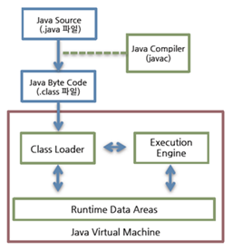

# Java Study

### 01 JVM 자바 가상 머신
자바 프로그램은 완전한 기계어가 아닌, 중간 단계의 바이트 코드라 이를 해석하고 실행해 줄 가상의 운영체제가 필요하다. 
이 역할을 수행하는 것이 JVM. 
바이트 코드는 모든 운영체제에 상관없이 언제나 같은 실행결과를 보장하지만 JVM은 운영체제에 종속적이므로 운영체제에 맞는 JVM을 설치해야한다. 
JVM은 JDK혹은 JRE를 설치하면 자동으로 설치된다.
#### JDK: Java Development Kit
- 자바 프로그램 개발시 필요한 도구(javac, java등)들을 포함
- JDK를 설치하면 JRE도 같이 설치가 된다.
#### JRE: Java Runtime Environment
- 컴파일된 자바 프로그램을 실행시킬 수 있는 자바 환경
- JVM이 자바 프로그램을 동작시킬 때 필요한 라이브러리 파일들과 기타 파일들을 가지고 있다.
- 자바 프로그램을 실행시키기 위해서는 필수로 설치되어야 한다.  

확장자가 .java인 소스 파일을 컴파일러(javac.exe)로 컴파일하여 확장자가 .class인 바이트 코드 파일을 생성한다. 
생성된 바이트 코드 파일은 jvm 구동 명령어(java.exe)를 통해 JVM에서 해석되고 운영체제에 맞게 기계어로 번역이 된다. 
자바의 가장 큰 장점은 한 번 작성하면 어디에서나 실행이 된다(Write Once, Run Everywhere)는 점이지만 
JVM을 한 번 거쳐 기계어로 번역되고 실행되기 때문에 C, C++과 같은 언어들보다 속도가 느리다는 단점이 있다. 
다만 JVM 내부의 최적화된 JIT컴파일러를 통해 속도의 격차는 많이 줄어들고 있다.
#### JIT: Just-In-Time compilation), 동적 번역
- 프로그램을 실제 실행하는 시점에 기계어로 번역하는 컴파일 기법
- Java에서는 바이트코드를 기계어로 번역할 때 사용된다.
- JIT 컴파일러는 같은 코드를 매번 해석하지 않고 실행할 때 컴파일을 하면서 해당 코드를 캐싱한다. 이후엔, 바뀐 부분만 컴파일 하고 나머지는 캐싱된 코드를 사용한다.
