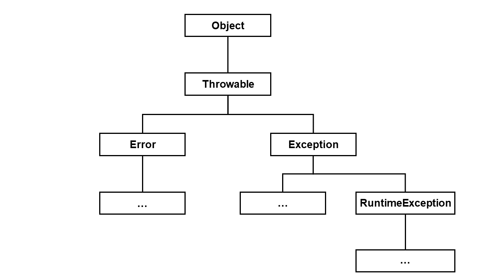

### 예외처리
#### Error and Exception

- 컴파일 에러, 런타임 에러
- 컴파일 에러는 자바 컴파일러가 오류를 잡아내준다.
- 런타임 에러는 잡아내지 못한다.
- 자바에서는 이 런타임 에러를 크게 두가지로 나눠 구분한다.
  - 예외, 에러
  

- Error: 시스템에 비정상적인 상황이 발생한 경우
  - 애플리케이션 안에서 핸들링을 할 수 없기에 예외처리를 할 수도 없다.
  - 프로그램은 비정상 종료된다.  
  - 주로 JVM에서 발생
  - OutOfMemoryError, StackOverFlowError  
  - 발생했을 때를 대비해 미리 무엇인가 준비할 수 있는게 없다.
  

- Exception: 사용자의 잘못된 조작 혹은 잘못된 코딩으로 인한 프로그램 오류
  - 애플리케이션 안에서 예외처리를 통해 핸들링이 가능하다.
  - RuntimeException
    - RuntimeException은 CheckedException과 UnCheckedException을 구분하는 기준
  
- CheckedException
  - 예외처리 필수
  - 컴파일 시점에 확인
  - 부가적인 작업을 할 수 있는 경우  
  - IOException
- RuntimeException(UncheckedException)
  - 명시적인 처리를 강제하지 않음
  - 실행 시점에 확인
  - 런타임 계열은 복구가 어려운 경우, 코드로 할 수가 없는 경우 unchecked  
  - NullPointerException

#### 예외 처리 방법
- try-catch
```java
try {
    // 예외가 발생할 가능성이 있는 코드
} catch (Exception1 e1) {
    // Exception1이 발생했을 때, 이를 처리하기 위한 코드
} catch (Exception2 e2) {
    // Exception2가 발생했을 때, 이를 처리하기 위한 코드
} catch (ExceptionN eN) {
    // ExceptionN이 발생했을 때, 이를 처리하기 위한 코드
} finally {
    //예외 발생 유무에 상관없이 항상 실행하는 코드
}
```
- try 블록은 예외가 발생할 가능성이 있는 범위를 지적하는 블록
  - 최소한 하나의 catch 블록이 있어야 하며, catch 블럭은 try 블록 다음에 위치
- catch 블록은 매개변수의 예외 객체가 발생했을 때 참조하는 변수명으로 반드시 java.lang.Throwable 클래스의 하위 클래스 타입으로 선언
  - 발생한 예외 객체 타입이 동일한 catch 블록을 수행
  - `**catch문은 여러개의 블록으로 구성할 수 있다.**`
  - 주의할 점은, catch블럭 작성 시 **부모클래스가 자식 클래스보다 먼저 catch에서 쓰이게 되면 컴파일 에러**가 발생하게 된다.
    - 순서 중요하다.
    - 계층구조, 상속관계가 존재한다.
    - 좁은 그물망일 수록 위에 둔다!
  

- 여러개의 catch 블럭이 생성되었고, 그 예외의 처리가 동일한 행위라면?
  - Multicatch Block
```java
try{
	.. do something
}catch(IllegalStateException | IllegalArugmentException e){
	// catch !!
}
```  

- **multicatch 로 묶는 Exception이 상속관계라면? 불가능하다.**
```java
public class App {
    public static void main(String[] args){
        try{
            // do something
        }catch(NullPointerException | IllegalArgumentException e){
            System.out.println(e.getClass());
        }
    }
}
```
- do something에서 무슨 예외가 발생했는지에 따라 다른 예외처리

- finally 
  - finally 블록이 사용되면 finally 블록에 작성된 내용은 예외 발생 유무나 예외 catch 유무와 상관없이 무조건 수형
- Finally  Block 안에서 Return 금지!
  - try 블록 안에서 발생한 예외는 무시되고 finally 거쳐 정상 종료
  
- `**throws**`
  - 예외가 발생한 메소드를 호출한 곳으로 예외 객체를 넘기는 방법.
  - 자바의 예외 처리 방법은 예외가 발생한 지점에서 try-catch 혹은 try-catch-finally 블록을 이용하여 직접처리 하지 않아도 예외가 발생한 메소드를 호출한 지점으로 예외를 전달하여 처리하는 방법이 있다.

- `**throw**`

  - 인위적으로 예외를 발생시킬 때 사용할 수 있는 **예약어 ⇒ throw**

  - 개발자가 의도하진 케이스에 대해 임의로 예외를 발생시킬 때 사용되며, 특정 예외를 만났을 때 더욱 구체적인 예외로 처리하고자 할 때에도 사용된다.

- try-with-resource
  - Java 7에서 들어온 기능으로 try block에서 사용할 resource를 선언하는 식으로 사용
  - finally block 대신에 resource를 자동으로 반환하기 위해 사용
  - 여기서 말하는 리소스는 java.lang.AutoClosable 이나 java.io.Closable을 구현한 오브젝트를 말하며 반드시 close 되야하는 리소스
```java
// Java 7 이후 try-with-resources
static String readFirstLineFromFile(String path) throws IOException {
    try (BufferedReader br =
                   new BufferedReader(new FileReader(path))) {
        return br.readLine();
    }
}

// Java 7 이전
static String readFirstLineFromFileWithFinallyBlock(String path)
                                                     throws IOException {
    BufferedReader br = new BufferedReader(new FileReader(path));
    try {
        return br.readLine();
    } finally {
        if (br != null) br.close();
    }
}
```  

- printStackTrace(), getMessage()Permalink
  - 예외처리를 할 때 발생한 예외의 대한 정보가 담긴 메서드이다.
  - catch 블럭의 참조변수를 통해 인스턴스에 접근할 수 있다.

- printStackTrace()
  - 예외 발생 당시에 호출스택에 있었던 메서드의 정보와 예외 메시지를 화면에 출력한다.
- getMessage()
  - 발생한 예외클래스의 인스턴스에 저장된 메시지를 얻을 수 있다.

1. 예외가 발생하면 다른 작업 흐름으로 유도하는 **`예외 복구`**
- 예외가 발생하여도 애플리케이션은 정상 흐름으로 진행된다
```java
private static void doSomething() {
  int maxRetry = MAX_RETRY;
  while(maxRetry --> 0){
      try{
          // 예외가 발생할 가능성이 있는 시도
          // 작업 성공 시 리턴
          return;
      }catch(SomeException e){
          // 로그 출력, 정해진 시간 만큼 대기
      }finally {
          // 리소스 반납 및 정리 작업
      }
  }
  throw new RetryFailedException(); // 최대 재시도 횟수를 넘기면 직접 예외 발생
}
```
2. 처리하지 않고 호출한 쪽으로 던져버리는 `**예외처리 회피**`
- 예외가 발생하면 throws를 통해 호출한 쪽으로 예외를 던지고 그 처리를 회피
- 호출한 쪽에서 다시 예외를 받아 처리하도록 하거나, 해당 메소드에서 이 예외를 던지는 것이 최선의 방법이라는 확신이 있을 때만 사용
```java
public void add() throws SQLException{
	// .. do something
}
```   
3. 호출한 쪽으로 던질 때 명확한 의미를 전달하기 위해 다른 예외로 전환하여 던지는 `**예외 전환**`
- 예외를 잡아서(catch) 다른 예외를 던지는 것
```java
try{
	.. do something
}
catch(SQLException e){
	throw DuplicateUserIdException();
}
```

- 위 그림을 살펴보면 Exception을 상속받는 클래스들 중에서 RuntimeException을 제외하고는 모두 Checked Exception이라고 표시되어 있다.
- Checked Exception은 컴파일 시점에서 확인될 수 있는 예외이다. 만약 코드 내에서 Checked Exception을 발생시킨다면, 해당 예외는 반드시 처리되거나, 해당 코드가 속한 메서드의 선언부에 예외를 선언해줘야 한다.

- Unchecked Exception은 컴파일 단계에서 확인되지 않는 예외이다. 
  - Java에서는 RuntimeException과 그 하위 클래스, 그리고 Error와 그 하위 클래스가 이에 속한다.
  - 이 예외들은 컴파일러가 예외를 처리하거나 선언하도록 강제하지 않는다. 프로그래머가 알아서 처리를 해야 한다.